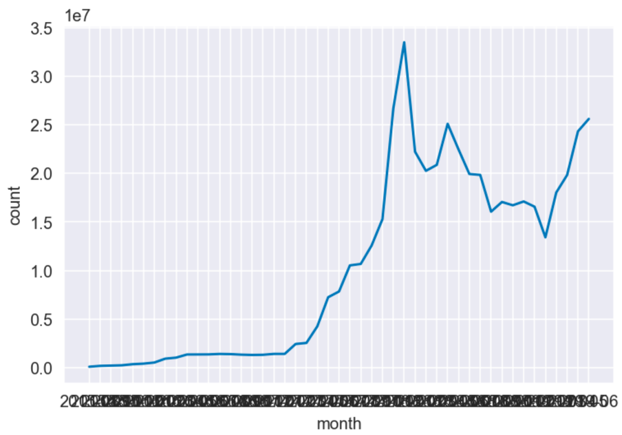
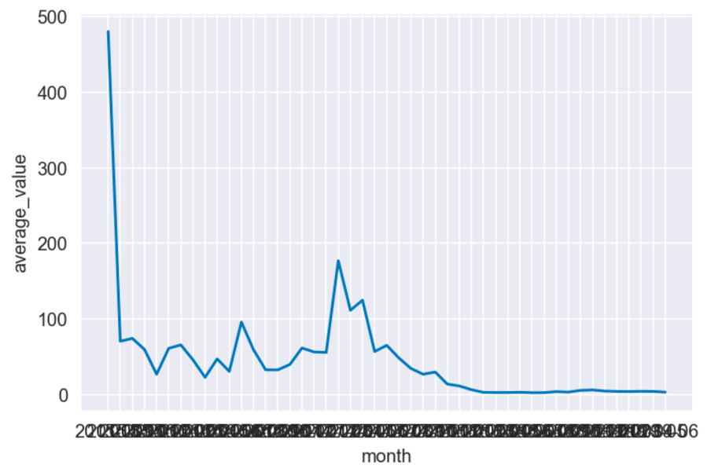

# Part A
## Requirement
The requirement of this part was to calculate the total and average number of transactions on the Ethereum mainnet in each month, using MapReduce.

## Deliverables
The MapReduce programmes produced were:
* [PartA_TransactionCount.py](PartA_TransactionCount.py) - Total number of transactions in each month
* [PartA_AverageTransactions.py](PartA_AverageTransactions.py) - Average number of transactions in each month

# Results
The results of this task were plotted as the following.

## Total number of transactions in each month

## Average number of transactions in each month
