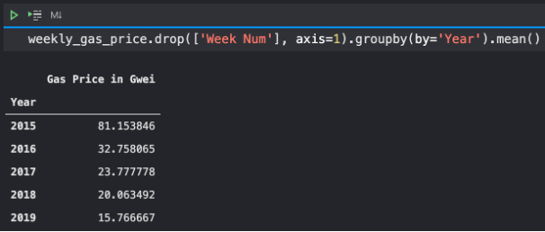
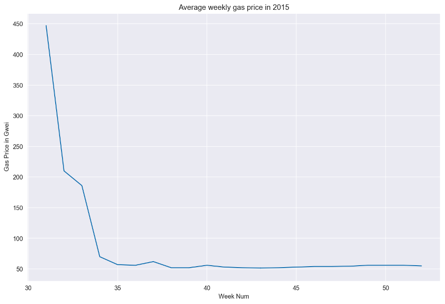
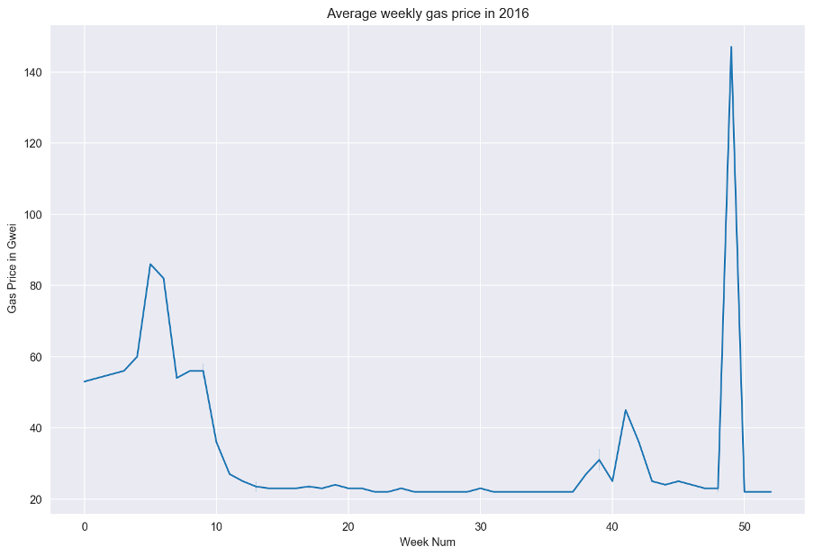
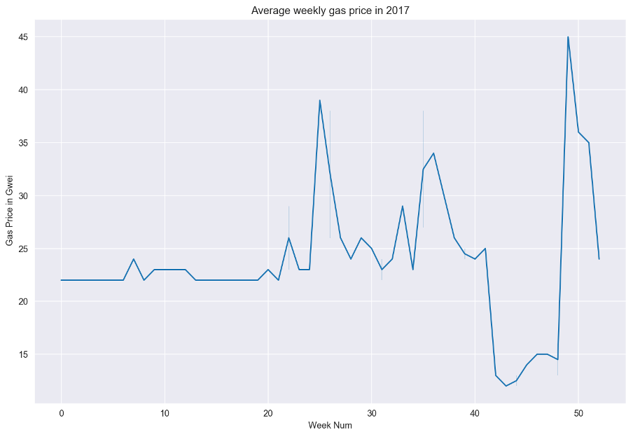
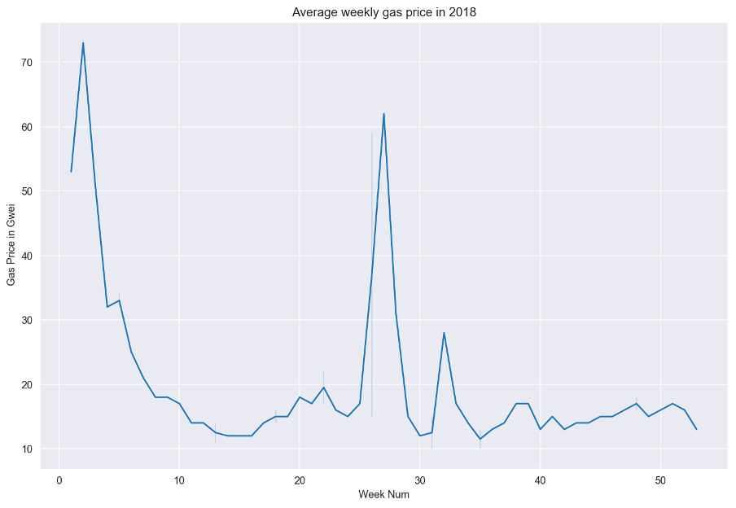
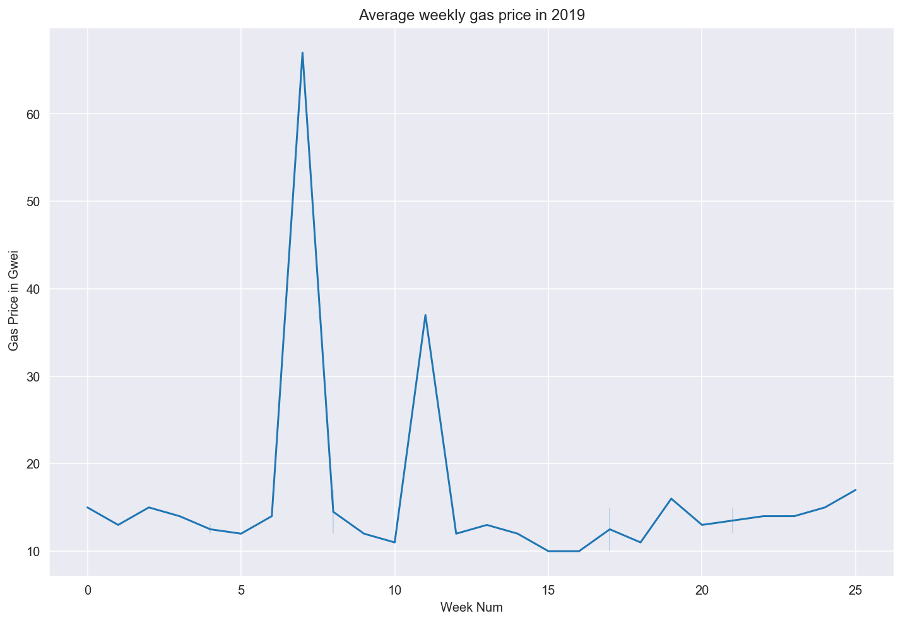
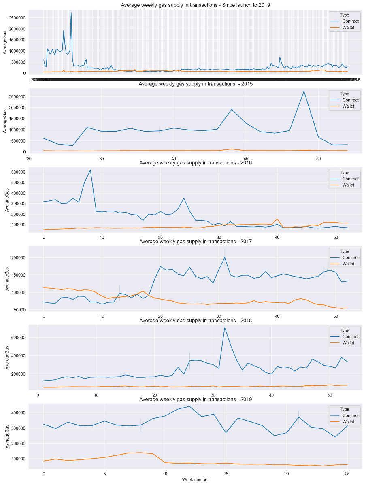
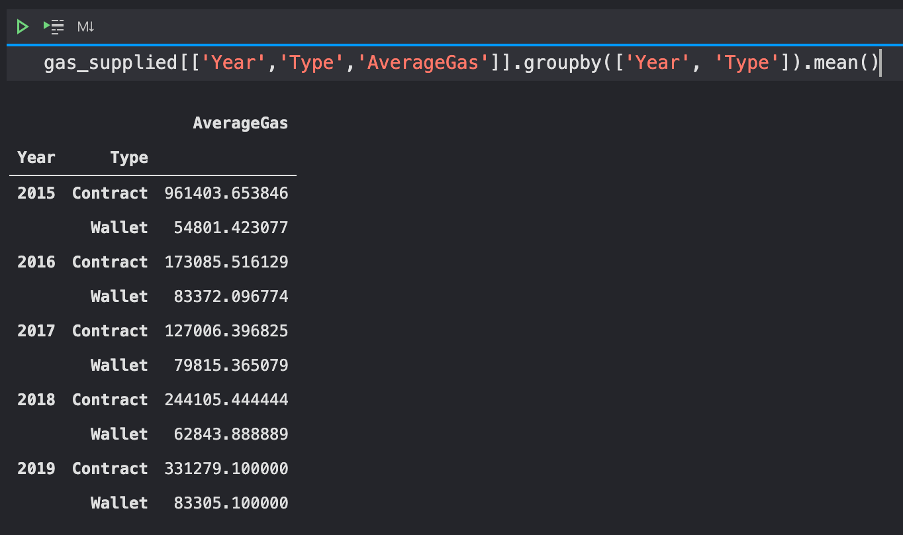

# Part D - Gas Price Analysis
## Requirement
This part was an optional task of the coursework. The task was to analyse the gas price and gas usage on the Ethereum network over time.

## Deliverable
[./PartD_GasPrice_Weekly.py](PartD_GasPrice_Weekly.py)
[./PartD_GasSupplied_WeeklyContract.py](PartD_GasSupplied_WeeklyContract.py)

## Results
First, we can import the data as a DataFrame and check the annual average gas price. The average gas price has been dropping since the launch of Ethereum in 2015.

During the initial release, the average gas price was as high as 450 Gwei, while the price dropped within 5 weeks and remained at the level around 50 Gwei throughout the year. The movement of the average gas price is plotted as the following.

Since the amount of gas supplied in an Ethereum is directly proportional to the amount of data carried in the transaction, another Spark job was prepared to obtain the average gas supplied in transactions towards contract addresses. However, since in the transactions data only the gas supplied was provided, it was not possible to determine the actual amount of gas used in the transaction, so an assumption of that the gas supplied was close enough to the actual gas used was made.

In general , the gas supply in contract transactions was the highest during the launch of the Ethereum network. However, this has dropped to a comparable level to the wallet transactions in 2016, and sometimes even lower.

After the first quarter in 2017, the average gas limit in contract transactions has been steadily raising, from 127K in 2017 to 331K in 2019.

Since the gas usage is directly proportional to the amount of data in the transaction, and earlier an assumption of gas supply being close to the actual used gas was made, it can be deduced that contracts have become more complicated, in terms of the amount of data being transferred over the Ethereum network, by requiring more gas in the transactions.

And one interesting observation is that, even most Ether wallet applications would default the gas limit (not gas price) of wallet transactions to 21000, the average gas limit of wallet transactions throughout these four years has always been greater than 50000. 
