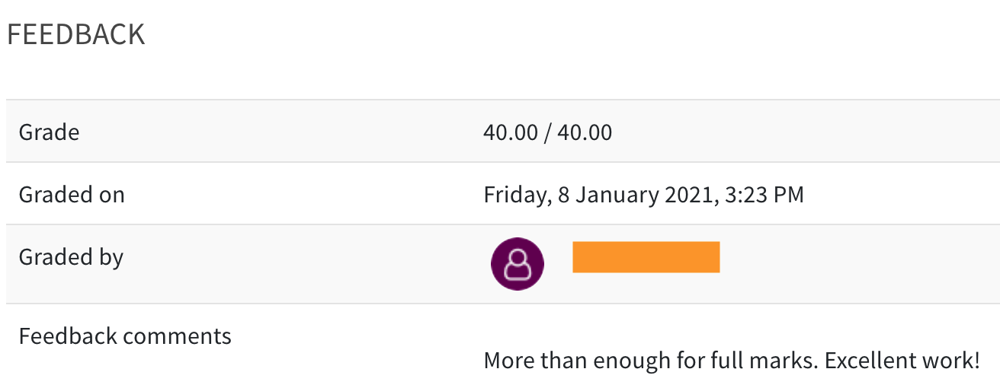

# Ethereum Transactions Analysis
This repository contains the deliverables of a piece of coursework on the analysis of Ethereum transactions, done using MapReduce and Spark.

The description and results of each part are available as the README file in each of the sub-directories.

# Deliverables
- [./PartA](PartA) - The total number and average Ether amount of transactions grouped by month
- [./PartB](PartB) - The most popular smart contracts
- [./PartC](PartC) - The most active miners
- Part D - Optional tasks
    - [./PartD_ForkAnalysis](PartD_ForkAnalysis) - Mapping Ethereum price with forks
    - [./PartD_GasAnalysis](PartD_GasAnalysis) - Gas price analysis
    - [./PartD_ScamAnalysis](PartD_ScamAnalysis) - Scam analysis
- [./Plots.ipynb] - Plots of data generated from various sections

# Input data
The data used in the coursework was stored in a shared HDFS cluster within the university. The data covered the Ethereum network from the genesis block in August 2015 until the end of June 2019.

## Blocks
The Ethereum blocks data were CSV files with the following fields:
- number: The block number
- hash: Hash of the block
- miner: The address of the beneficiary to whom the mining rewards were given
- difficulty: Integer of the difficulty for this block
- size: The size of this block in bytes
- gas_limit: The maximum gas allowed in this block
- gas_used: The total used gas by all transactions in this block
- timestamp: The timestamp for when the block was collated
- transaction_count: The number of transactions in the block

## Transactions
The Ethereum transactions data were CSV files with the following fields:
- block_number: Block number where this transaction was in
- from_address: Address of the sender
- to_address: Address of the receiver. null when it is a contract creation transaction
- value: Value transferred in Wei (the smallest denomination of ether)
- gas: Gas provided by the sender
- gas_price : Gas price provided by the sender in Wei
- block_timestamp: Timestamp the associated block was registered at (effectively timestamp of the transaction)

## Contracts
The Ethereum contracts data were CSV files with the following fields:
- address: Address of the contract
- is_erc20: Whether this contract is an ERC20 contract
- is_erc721: Whether this contract is an ERC721 contract
- block_number: Block number where this contract was created

## Scams
The data of known crypto scam addresses were in a JSON file.
- id: Unique ID for the reported scam
- name: Name of the Scam
- url: Hosting URL
- coin: Currency the scam is attempting to gain
- category: Category of scam - Phishing, Ransomware, Trust Trade, etc.
- subcategory: Subdivisions of Category
- description: Description of the scam provided by the reporter and datasource
- addresses: List of known addresses associated with the scam
- reporter: User/company who reported the scam first
- ip: IP address of the reporter
- status: If the scam is currently active, inactive or has been taken offline

# Grade of the Coursework
Sorry for sounding arrogant but this was what happened.
